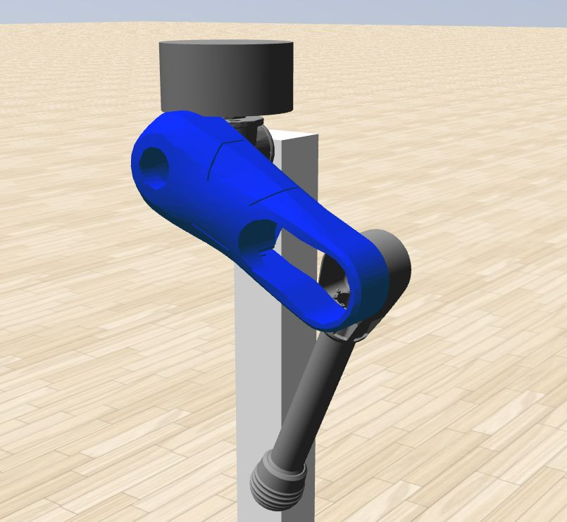

# Awesome Leg (Pholus-based version)

Andrea Patrizi's work on controlling our awesome leg.

Repo structure:

📦awesome_leg_pholus
 ┣ 📂config
 ┣ 📂description
 ┃ ┣ 📂meshes
 ┃ ┃ ┣ 📂collision
 ┃ ┃ ┗ 📂visual
 ┃ ┣ 📂sdf
 ┃ ┣ 📂srdf
 ┃ ┣ 📂urdf
 ┣ 📂launch
 ┣ 📂media
 ┣ 📂repo_images
 ┣ 📂rviz
 ┣ 📂src
 ┣ 📂worlds
 ┣ 📜CMakeLists.txt
 ┗ 📜package.xml
